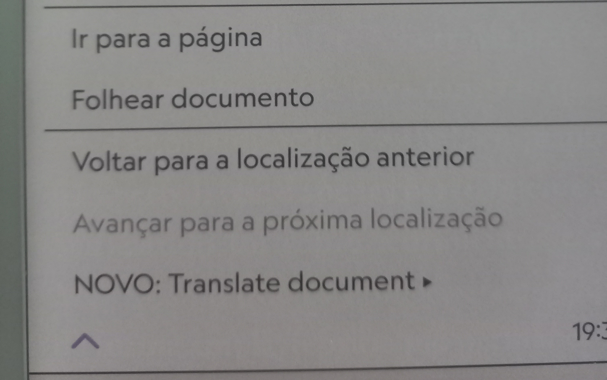
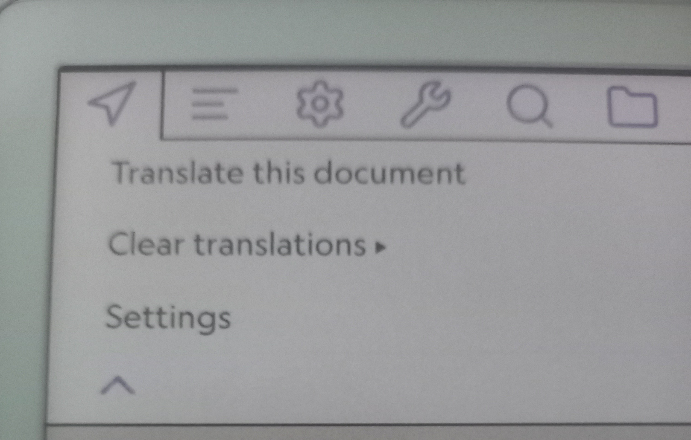

# Document Translator — KOReader Plugin

Translates open documents (EPUB, HTML, TXT) using **Google Translate** or **DeepL**, saving the result as a new file in `koreader/translations/`. The original file is never modified.

---

## Screenshots

<!-- Add screenshots here -->
| Menu | Settings | Translated document |
|------|----------|-------------------|
|  |  | 
---

## Features

- Translate the currently open document with one tap
- Supports **EPUB**, **HTML** and **TXT**
- **Google Translate** (free, no key required) or **DeepL** (API key required)
- EPUB translation preserves all formatting — chapters, headings, bold, italics
- Translated file saved as `document_traduzido.epub` in a dedicated folder
- If a translation already exists, asks whether to open it or translate again
- Cache manager to delete individual or all translated files

---

## Install

1. Download the `translatordoc.koplugin` folder from this repository
2. Connect your device to a PC
3. Copy the entire `translatordoc.koplugin` folder to:

   **Kobo:**
   ```
   KOBOeReader/.adds/koreader/plugins/
   ```
   **Kindle:**
   ```
   koreader/plugins/
   ```
   **Android:**
   ```
   /sdcard/koreader/plugins/
   ```

   > **Note for Kobo:** `.adds` is a hidden folder — enable "Show hidden files" in your file manager.

4. Restart KOReader
5. The **"Translate document"** option will appear in the reader menu (☰)

---

## Usage

1. Open any EPUB, HTML or TXT document in KOReader
2. Open the menu (☰) → **Translate document** → **Translate this document**
3. Wait for the *"Translating... please wait."* message to disappear
4. The translated document opens automatically

---

## Settings

Menu (☰) → **Translate document** → **Settings**

| Field | Description | Default |
|---|---|---|
| Target language | BCP-47 code, e.g. `pt-BR`, `en`, `es`, `fr` | `pt-BR` |
| Google API key | Leave empty to use the free (unofficial) endpoint | *(empty)* |
| DeepL API key | Required to use DeepL | *(empty)* |
| Translation engine | `google` or `deepl` | `google` |

Settings are saved to `koreader/settings/translatordoc.lua`.

---

## Cache Management

Menu (☰) → **Translate document** → **Clear translations**

- **Delete all translations** — removes every file in `koreader/translations/`
- **Delete selected translation** — lists translated files and lets you pick which to delete

Deleting a translation does not affect the original document. The next time you open the original and tap "Translate", a fresh translation is created.

---

## File Structure

```
translator.koplugin/
    _meta.lua             — plugin metadata
    main.lua              — menu, settings, lifecycle
    translator.lua        — Google/DeepL API, text chunking, HTML node translation
    epub.lua              — EPUB unpack, translate, repack
    translation_cache.lua — cache list and delete functions
```

---

## Notes

- **Google free endpoint**: works without a key but has no official SLA. For heavy use, supply a key from [Google Cloud Console](https://console.cloud.google.com/).
- **DeepL free tier**: 500,000 characters/month. Keys ending in `:fx` are Free tier. Get a key at [deepl.com/pro-api](https://www.deepl.com/pro-api).
- PDF is not supported.
- Kindle requires KOReader to be installed (which requires jailbreak).

---

## Tested on

| Device | KOReader Version |
|---|---|
| Kobo Libra Color | v2026.03 |

---

## Credits

Developed with assistance from [Claude](https://claude.ai) (Anthropic).

---

## License

MIT
